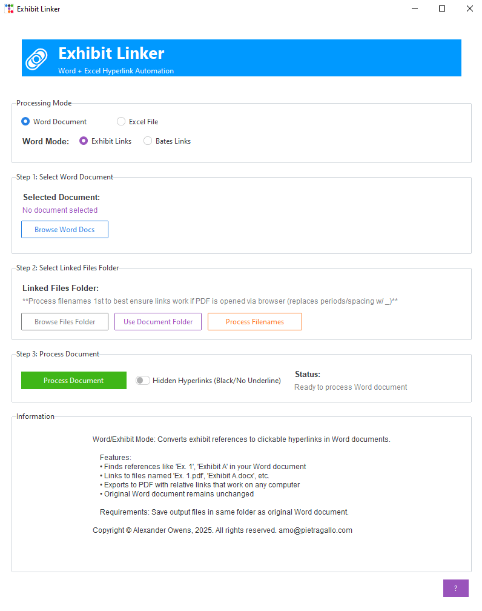
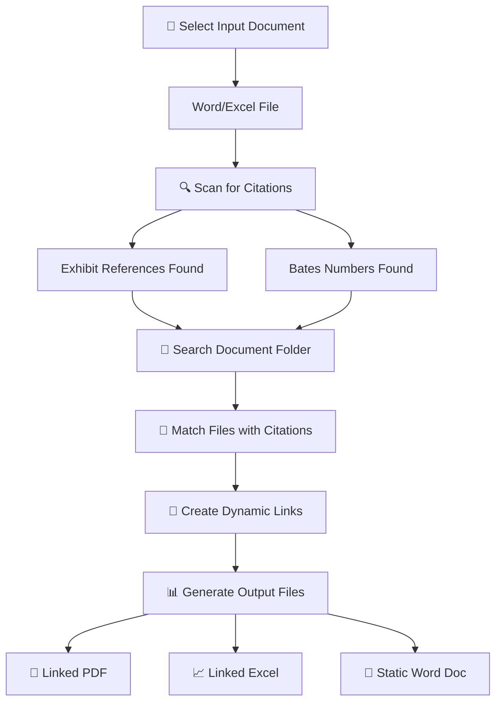

# Exhibit-Linker

# Overview
Dynamically linked files are helpful for submitting legal memoranda, investigative reports, and other documents where you want the recipient to have instantaneous access to the files cited in your work product.

Exhibit Linker is a Python script that allows users to select a Word or Excel file to automatically create dynamic links to exhibits or Bates-stamped documents. The script reads your Word or Excel document, locates exhibit or Bates citations, uses regex to find the cited documents in a user-designed folder, and then creates dynamically linked Excel and PDF output files. A Word documents can also be created, but the linking therein will be static only (unlike dynamic links, static links will only work on the script user's computer).

As long as your exhibits are in the same folder as your PDF or are otherwise in the same relative position (e.g., the parent PDF in one folder and exhibits in a given subfolder), the linking in the output PDF or Excel will work. Even if the PDF and exhibits are moved elsewhere on your hard drive or to another PC, so long as the exhibits travel with it in in the same relative position, the linking will work.

Further, Bates citations will open the operative PDF even if the cited page is mid-document (e.g., if SMITH_005 is found within SMITH_003.pdf, it will link to that file) and, if the output PDF is opened in Chrome, the link will even open to the correct Bates-stamped page. So, in the SMITH_005 example, the link would open a Chrome window to page 3 of that PDF.

To best ensure compatabiltity across non-Acrobat PDF viewers (e.g., if the end user is going to use Chrome to view the output file), it is best that the linked documents lack spacing and periods in their filenames. This is because such formatting can confuse Chrome into thinking that the links are to the internet. This script can modify the linked files' names accordingly (if the user chooses) by swapping in underscores (e.g. Ex. 1 Memo.pdf becomes Ex_1_Memo.pdf).

## 🔄 How It Works

### Step-by-Step Workflow

```mermaid
graph TD
    A[📄 Select Input Document] --> B[Word/Excel File]
    B --> C[🔍 Scan for Citations]
    C --> D[Exhibit References Found]
    C --> E[Bates Numbers Found]
    D --> F[📁 Search Document Folder]
    E --> F
    F --> G[🎯 Match Files with Citations]
    G --> H[🔗 Create Dynamic Links]
    H --> I[📊 Generate Output Files]
    I --> J[📑 Linked PDF]
    I --> K[📈 Linked Excel]
    I --> L[📝 Static Word Doc]
```

### Process Details

| Step | What Happens | Result |
|------|-------------|---------|
| **1. Document Input** | Select your Word or Excel file containing exhibit references | Script reads document content |
| **2. Citation Detection** | Regex patterns scan for exhibit citations and Bates numbers | All references identified |
| **3. File Matching** | Search designated folder for matching exhibit files | Files paired with citations |
| **4. Link Creation** | Generate dynamic hyperlinks with relative paths | Cross-platform compatibility |
| **5. Output Generation** | Create new files with embedded links | PDF, Excel, and Word outputs |

### 🎯 Smart Matching Examples

The script intelligently matches various citation formats:

- **Exhibit References**: `Ex. 1`, `Exhibit A`, `Exh. 12`
- **Bates Numbers**: `SMITH_001`, `DOC-2023-045`, `CASE_A_123`
- **Page-Specific**: Opens to exact Bates page within multi-page PDFs

### 🔧 File Processing Options

- **✅ Dynamic Links**: Work across different computers and platforms
- **📱 Chrome Optimization**: Direct page navigation in Chrome browser
- **🔄 Filename Sanitization**: Replace spaces/periods with underscores for compatibility
- **📂 Relative Paths**: Maintain links when files are moved together

# Pointers

Ensure that Word and Excel are closed before running the script.

Zip your resulting files if sending to other users.

# Quick Start

**Clone the repository**
git clone https://github.com/owens255/exhibit-linker.git

**Navigate to the project directory**
cd exhibit-linker

**Install dependencies**
pip install -r requirements.txt

**Run the application**
python exhibit_linker.py

