# Exhibit-Linker

## Overview
File hyperlinking is helpful for submitting legal memoranda, investigative reports, and other documents where you want the recipient to have instantaneous access to the files cited in your work product.

Exhibit Linker is a Python script that allows users to select a Word or Excel file and then automatically create relative links to exhibits or Bates-stamped documents. The script reads your document, locates exhibit or Bates citations, uses regex to find the cited documents in a user-designed folder, and then creates relatively linked Word/Excel and PDF output files.  

As long as your exhibits are in the same folder as your PDF or are otherwise in the same relative position (e.g., the parent PDF in one folder and exhibits in a given subfolder), the linking in the output PDF or Excel will work. Even if the PDF and exhibits are moved elsewhere on your hard drive or to another PC (e.g., via email), so long as the exhibits travel with it in the same relative position, the linking will work.

The script can also employ pattern matching to determine the page number in a legal citation (e.g., Ex. 99, Memo, at p. 9) and link to the cited page of the operative PDF exhibit. Further, Bates citations will open the operative PDF even if the cited page is mid-document (e.g., if SMITH_005 is found within SMITH_003.pdf, it will link to that file) and, if the output PDF is opened in Chrome, the link will even open to the correct Bates-stamped page. So, in the SMITH_005 example, the link would open a Chrome window to page 3 of that PDF.

If your "parent" document and exhibits are in the same folder and the end user will use Chrome to open your PDF, it is best that the linked documents lack spacing and periods in their filenames.  This is not an issue with this script.  It is an inherent limitation of Chrome's ability to interpret hyperlinks for certain local files.  Given that issue, this script can automatically modify the linked files' names accordingly (if the user chooses) by swapping in underscores (e.g. Ex. 1 Memo.pdf becomes Ex_1_Memo.pdf).  That way you can ensure Chrome compatibility if you prefer.  If your exhibits are in a separate subfolder or your end user will not use Chrome or a similar browser as a PDF viewer, such processing should be unnecessary.


## 🔄 How It Works

### Step-by-Step Workflow

```mermaid
graph TD
    A[📄 Select Input Document] --> B[Word/Excel File]
    B --> C[🔍 Scan for Citations]
    C --> D[Exhibit References Found]
    C --> E[Bates Numbers Found]
    D --> F[📁 Search Document Folder]
    E --> F
    F --> G[🎯 Match Files with Citations]
    G --> H[🔗 Create relative Links]
    H --> I[📊 Generate Output Files]
    I --> J[📑 Linked PDF]
    I --> K[📈 Linked Excel]
    I --> L[📝 Linked Word Doc]
```




### 🎯 Smart Matching 

The script intelligently matches various citation file name formats:

- **Exhibit References**: `Ex. 1`, `Exhibit A`
- **Bates Numbers**: `SMITH_001`, `CASE_A_123`
- **Page-Specific**: Opens to exact page within PDFs (if PDF is viewed via Chrome -- Adobe, however, will open the file to first page of the relevant PDF).

### 🔧 File Processing 

- **✅ Relative Links**: Work across different computers 
- **📱 Chrome Optimization**: Direct page navigation in Chrome browser
- **🔄 Filename Sanitization**: Replace spaces/periods with underscores for compatibility (optional)
- **📂 Relative Paths**: Maintain links when files are moved together

# Tips

- Ensure that Word and Excel are closed before running the script.

- Save your output files to the same folder as the original Word/Excel file.

- Always close the app by clicking the "x" button at the top right of the window.  This will ensure that your original Word settings are not altered. 

- Zip your resulting files if sending to others for easy transport. 


# Quick Start
**Clone the Repo**

**Install dependencies**
```pip install pywin32 ttkbootstrap pypdf```

**Run the application**
```python Exhibit_Linker.py```

